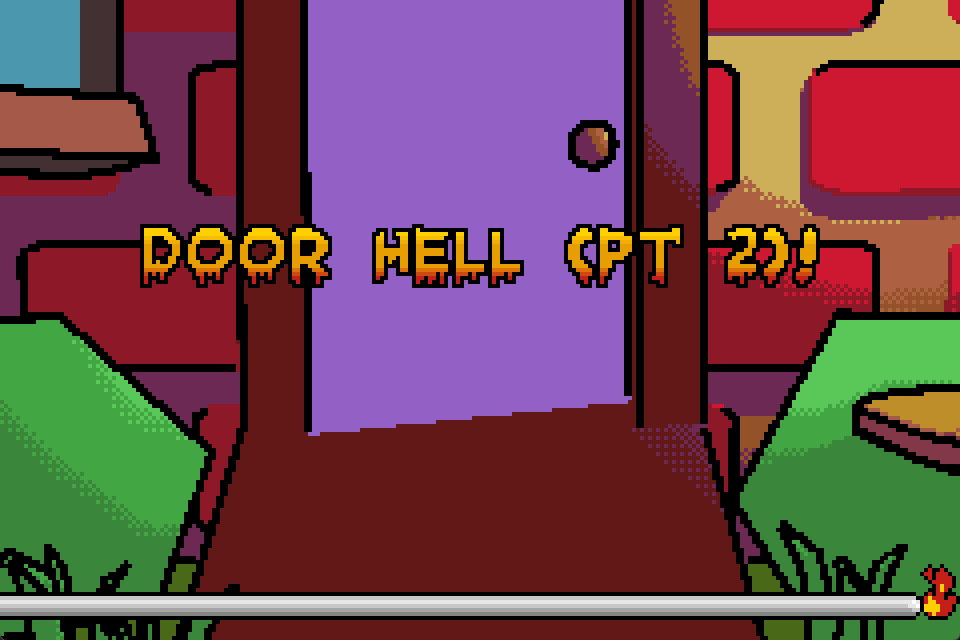

# DoorHell.gba

A [Microjam23](https://itch.io/jam/gba-microjam-23) submission for the Gameboy Advance about going trick-or-treating. First find and ring the doorbell, next find and grab your favorite candy.  You can check out the full game here: [Microjam23 Github page](https://github.com/gbadev-org/microjam23).

&nbsp;
&nbsp;

Part 1 - Ring the Doorbell |
:---------------:|
 |

The first is a microgame about ringing a door bell. As the difficulty increases, so does the number of possible locations it may appear.

| Action | Control |
| ------------- | ------------- |
| Move Forwards/Backwards | UP/DOWN |
| Look Left/Right | LEFT/RIGHT |
| Ring Doorbell | A |

&nbsp;
&nbsp;

### 

Part 2 - Pick Your Favorite Candy |
:---------------:|
 |

The second is a microgame about selecting your favorite piece of candy. Memorize the candy logo on your phone and pick it out from the candy basket! As the difficulty increases, more candy will obscure your favorite. There may even be knock-offs that look similar... BUT ARE WRONG!

| Action | Control |
| ------------- | ------------- |
| Move Hand | CONTROL PAD |
| Grab Candy | A |
| Push Candy | B |
