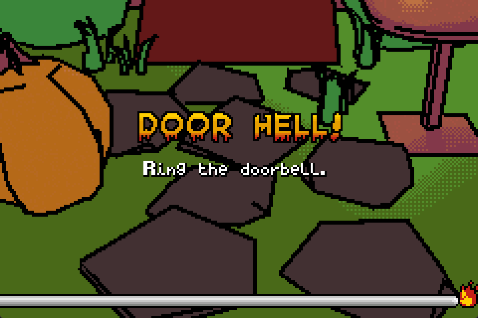
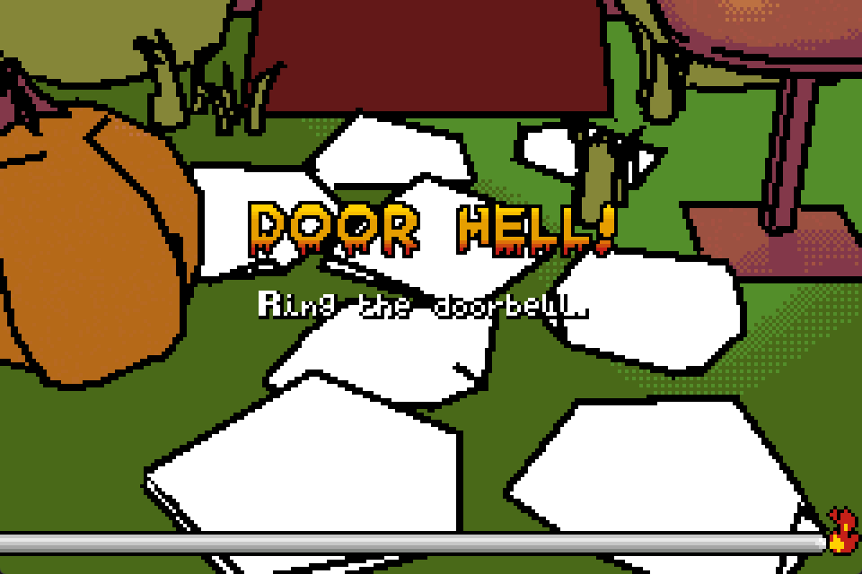

# DoorHell.gba

A [Microjam23](https://itch.io/jam/gba-microjam-23) submission for the Gameboy Advance about ringing a door bell. Check out the full game here: [Microjam23 Github page](https://github.com/gbadev-org/microjam23).

"Door Hell" is comprised of two parts.

### Part 1 - Ring the Doorbell

The first is a microgame about ringing a door bell. As the difficulty increases, so does the number of possible locations it may appear.

Controls
* MOVE = UP/DOWN
* LOOK = LEFT/RIGHT
* RING = A

### Part 2 - Pick Your Favorite Candy

The second is a microgame about selecting your favorite piece of candy. Memorize the candy logo on your phone and pick it out from the candy basket! As the difficulty increases, more candy will obscure your favorite. There may even be knock-offs that look similar... BUT ARE WRONG!

Controls
* MOVE HAND = CONTROL PAD
* TAKE CANDY = A
* PUSH CANDY = B
